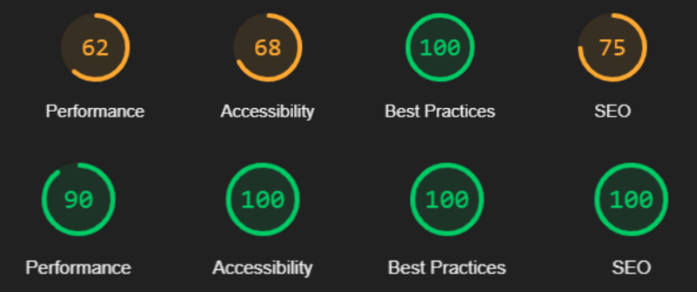

# Debugging and optimizing Nina Carducci's photographer website.

This repository contains details of the project aimed at optimizing Nina Carducci's website, a professional photographer based in Bordeaux, France. 
The intervention report below outlines the various enhancements made to the site, as well as additional achievements requested by the client.

## LightHouse report Before / After

## Features

- Presentation of Nina Carducci's photography projects, with high-quality images and detailed descriptions.
- Ability to browse through different categories of projects, such as weddings, portraits, concerts, etc.
- Contact form allowing visitors to get in touch with Nina Carducci for project inquiries or collaborations.

## Enhancements Implemented

- **Image Optimization**: Initially, the project contained 15 images totaling 30MB. The following modifications were made to the images:
   - Addition of modern AVIF files, which are lighter than traditional JPEG files but may not be accessible to all search engines.
   - Provision of a fallback with JPEG files for engines not accepting AVIF.
   - Definition of image sizes in HTML to facilitate loading.
   - Addition of alternative text for accessibility and SEO.
   - Implementation of Lazy Loading on images not displayed initially to load essential site elements faster.
   - Resizing of images to ensure they do not exceed the maximum size displayed on the site.
   - Addition of different image sizes for the main element to load it faster.
   - Replacement of the Instagram logo (Poor Quality) with an SVG format Instagram logo.
   After modifications, the total weight of the images is 1.65MB in equivalent formats, resulting in a 94.5% reduction. The project now includes 32 images:
      - 15 base files
      - 14 AVIF files
      - 1 new SVG Instagram logo
      - 2 responsive images for the main content

- **SEO Optimization**:
   - Implementation of local SEO with Schema.org.
   - Addition of language in the HTML tag to specify "French".
   - Modification of the site title to use keywords for SEO.
   - Addition of a customized description for displaying a more coherent result on search engines.
   - Inclusion of Meta tags for social media to improve how the site appears when shared on networks.

- **Accessibility Enhancement**: Before optimization, accessibility was limited. Modifications made include:
   - Addition of alternative text for each image.
   - Addition of labels and autocomplete for the form.
   - Inclusion of the language property (FR) in the HTML tag.
   - Modification of button filter colors to improve contrast.
   - Change of HTML tags (order of heading tags h1 > h2 > h3…), addition of "section" instead of "div", and other HTML tag changes to adapt the content to HTML5 standards.

- **Additional Client Request**: 
   - Implementation of Local SEO via Schema.org with details communicated to search engines.

## Bug Fix
Details of debugged features and their status:

| ID | Action | Initial Result | Expected Result | Status | Remarks and Comments |
|----|--------|----------------|-----------------|--------|----------------------|
| 1  | Addition of Active class in addition to the active-tag class when clicking on a filter button | Button Default Activated on ALL but the active property is not added when clicking a new filter button | Addition of the Active property to the clicked filter button | Resolved | - |
| 2  | Modification of the image index on click +1 for next -1 for prev | Next & Prev buttons do not work in the gallery, no reaction when clicked | Image switches to the previous or next one when the buttons are clicked | Resolved | - |

This outlines the enhancements made to Nina Carducci's website, including image optimization, bug fixing, SEO, accessibility improvements, and additional client requests.
